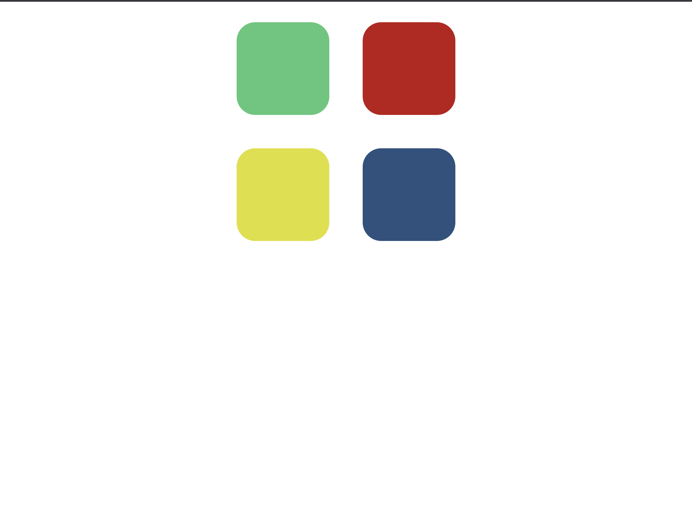

 An embedded screenshot of the app
 

 List of the Technologies used

    A Computer, Visual Studio Code, and Imagination.

 Installation instructions

 Your User stories – who are your users, what do they want and why?

    My users include the players. myself and the people who wish to use my game as a model.

 Your Wireframes – sketches of major views / interfaces in your application

![] (FrameWork.jpeg)

 Descriptions of any Unsolved problems or major hurdles you had to overcome

    As I was working through this code, I had to troubleshoot many things. I had to do a
    deep dive into Jquery to have the game start and control the DOM to perform the color changes. Dedicating time to each component.

Descriptions of any Unsolved problems or major hurdles you had to overcome

    A problem I know that can be included is that the game does not repeat the colors to let the user know the previous levels' pattern. This makes the game extremely more difficult for the users.